# TELESTO

## Scale-Adaptive Intelligence for Biological Manufacturing

> **Learning how biological processes change as they scale — and deciding what to do next.**

TELESTO is a research project investigating **adaptive decision-making in biological manufacturing under changing process dynamics**.

Instead of asking only:

> **What action should the system take?**

TELESTO asks:

> **Does the system understand the current process well enough to act, or should it measure, experiment, wait, adapt, or escalate?**

The first research domain is **fed-batch microbial fermentation**.

---

# Research Question

> **Can an uncertainty-aware decision system adapt a learned fermentation policy across scale and operating-regime shifts while learning when additional information is worth acquiring?**

---

# Research Architecture


## Core Decision Loop

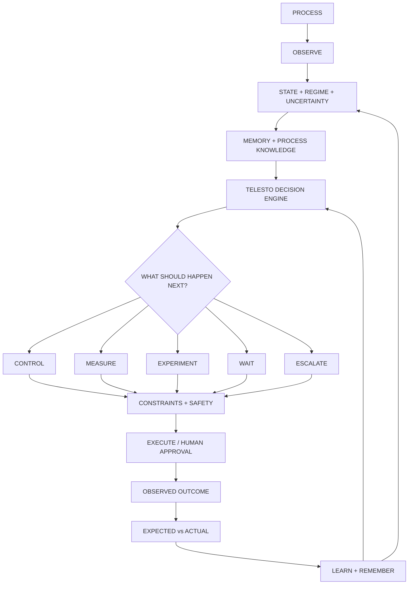

---

# Current Status

| Phase | Status |
|---|---|
| Research Definition | ✅ Complete |
| Fermentation Digital Twin | 🚧 **Current** |
| Control Baselines | Planned |
| Scale / Regime Shift | Planned |
| Uncertainty + Regime Detection | Planned |
| Adaptive Decision Policy | Planned |
| Information as an Action | Planned |
| Counterfactual Evaluation | Planned |
| Experience Memory | Planned |
| Process Knowledge + LLM | Planned |
| Full TELESTO | Planned |
| Ablation + Robustness Studies | Planned |

> **Current principle: environment before intelligence.**

We are **not** starting with RL or an LLM.  
The first task is to build and validate the fermentation environment.

---

# Phase 1 — Fermentation Digital Twin

The initial process domain is **fed-batch microbial fermentation**.

The first implementation will use **IndPenSim / PenSimPy** as the fermentation research testbed behind a TELESTO-owned process interface.

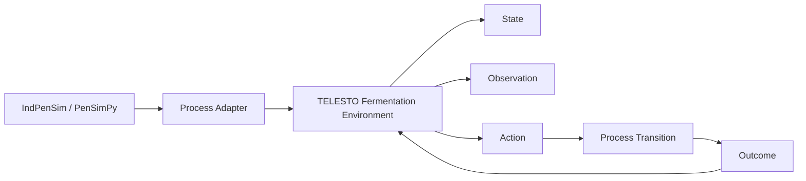

The simulator is the **process world**.  
TELESTO will provide the abstraction used by future control, learning, and decision-making components.

---

# Fermentation Environment

The initial environment will expose four fundamental concepts:

### State

Potential internal process variables include:

- biomass
- substrate
- product
- dissolved oxygen
- temperature
- pH
- volume
- relevant kinetic/process variables
- equipment-dependent parameters

### Observations

The decision system receives defined process measurements rather than unrestricted access to the complete hidden state.

Potential measurements include:

- temperature
- pH
- dissolved oxygen
- volume
- feed
- aeration
- agitation

Observation noise, sampling frequency, and measurement delay can later be introduced as controlled experimental variables.

### Actions

The initial action space will remain deliberately small and focus on meaningful controllable process inputs such as:

- feed
- aeration
- agitation

### Outcome

Each environment step produces the resulting process trajectory, objective metrics, and constraint information.

---

# Fermentation Environment Architecture

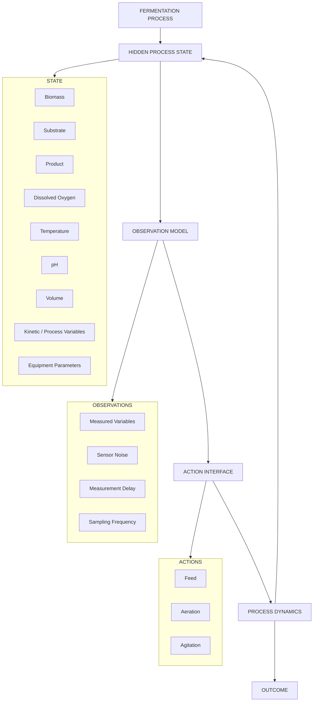

---

# Phase 1 Deliverables

The first milestone is complete only when the environment can reliably support controlled experiments.

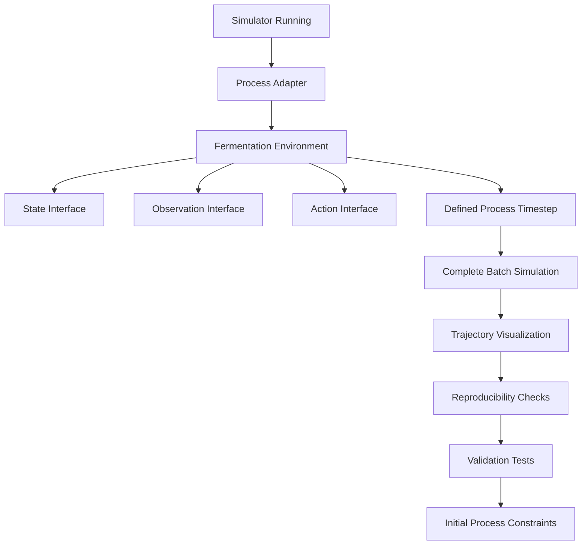

---

# Research Roadmap

```mermaid
flowchart LR

    A["01<br/>FERMENTATION DIGITAL TWIN"]
    B["02<br/>CONTROL BASELINES"]
    C["03<br/>SCALE / REGIME SHIFT"]
    D["04<br/>UNCERTAINTY + REGIME DETECTION"]
    E["05<br/>ADAPTIVE DECISION POLICY"]
    F["06<br/>INFORMATION AS AN ACTION"]
    G["07<br/>COUNTERFACTUAL EVALUATION"]
    H["08<br/>EXPERIENCE MEMORY"]
    I["09<br/>PROCESS KNOWLEDGE + LLM"]
    J["10<br/>FULL TELESTO"]
    K["11<br/>ABLATION + ROBUSTNESS"]

    A --> B --> C --> D --> E --> F --> G --> H --> I --> J --> K
```

---

# Scale and Operating-Regime Shift

Once the baseline process and controllers are established, TELESTO will deliberately introduce changes to the process dynamics.

Potential shifts include:

- scale
- equipment characteristics
- mixing behaviour
- oxygen-transfer behaviour
- process delays
- sensor characteristics
- kinetic parameters
- disturbance distributions

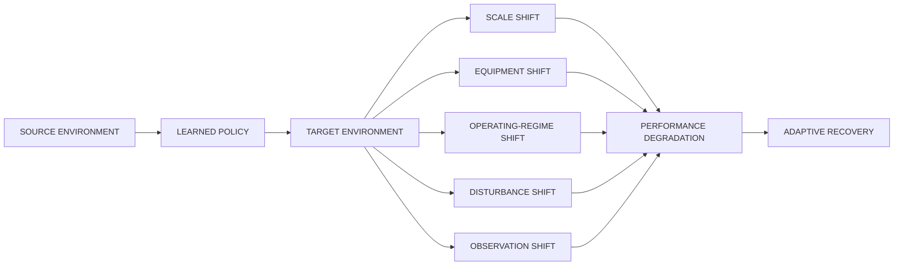

The project will distinguish between **virtual experimental scale changes** and physically validated industrial scale-up.

---

# Uncertainty and Regime Detection

The system must eventually recognize when it is operating outside familiar conditions.

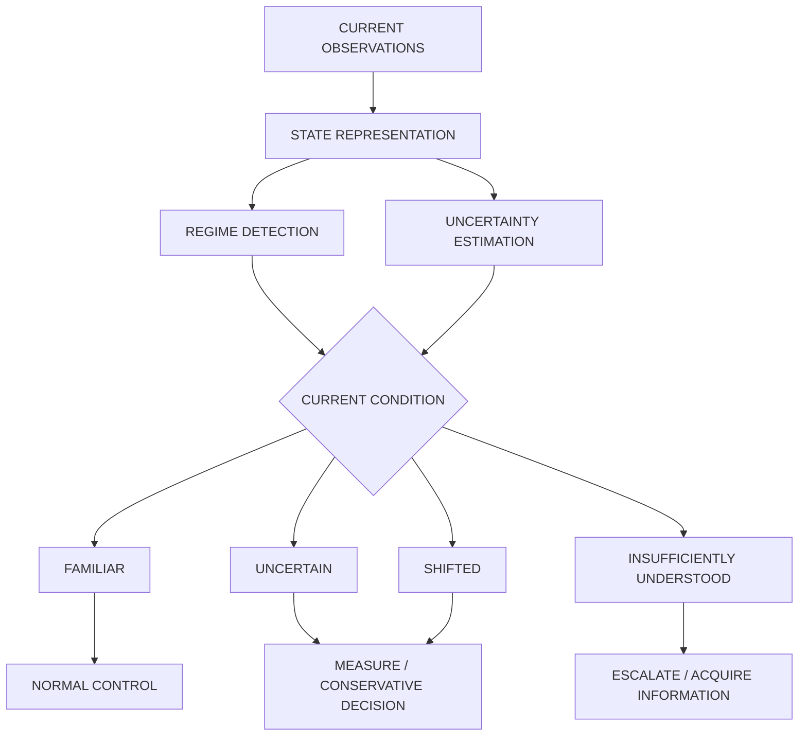

The objective is not merely to calculate uncertainty.

> **Uncertainty must change behaviour.**

---

# Information as an Action

One of TELESTO's central ideas is that **information acquisition can itself be a decision**.

The system may eventually choose between:

- acting immediately
- measuring first
- running an experiment

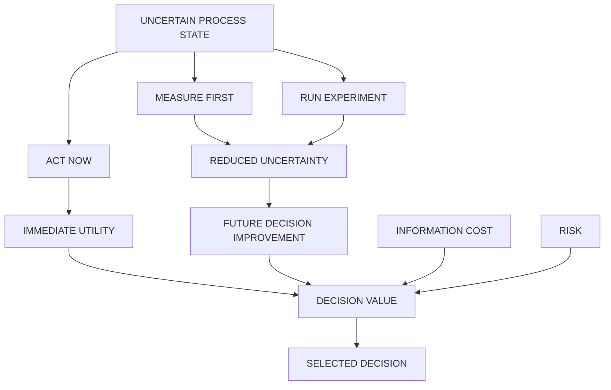

The research goal is to study the trade-off between **decision utility, information value, information cost, and risk**.

---

# Experience Memory

Important decisions should produce reusable experience.

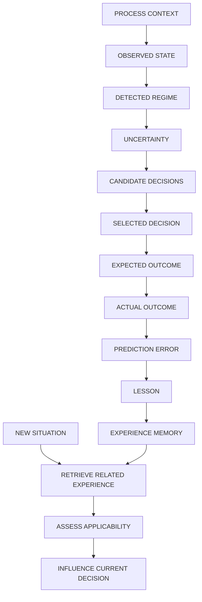

The research question is:

> **Does retrieving previous experience measurably improve later decisions?**

---

# Counterfactual Decision-Making

The digital twin will eventually be used to evaluate possible futures before important decisions are executed.

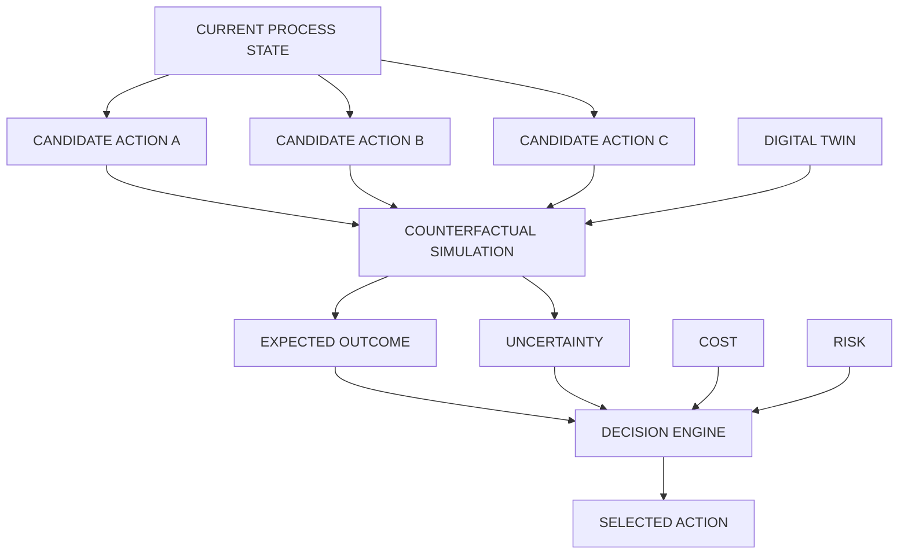

---

# Process Knowledge and LLM

The LLM enters as a **knowledge interface**, not an unrestricted controller.

It can eventually interpret:

- SOPs
- batch documentation
- operator notes
- engineering guidance
- experimental records

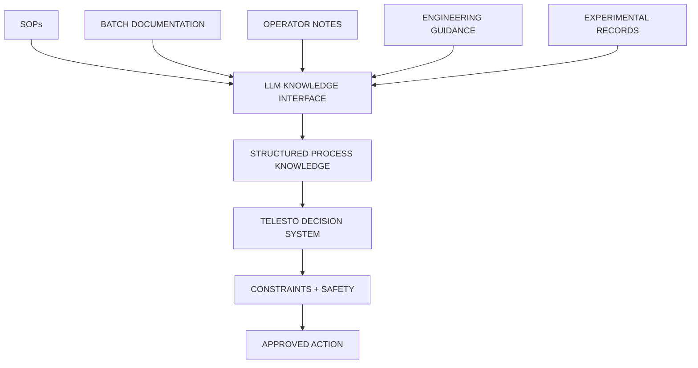

The LLM does **not** receive unrestricted actuator authority.

---

# Constraints and Safety

Every eventual autonomous decision must pass through a dedicated safety layer.

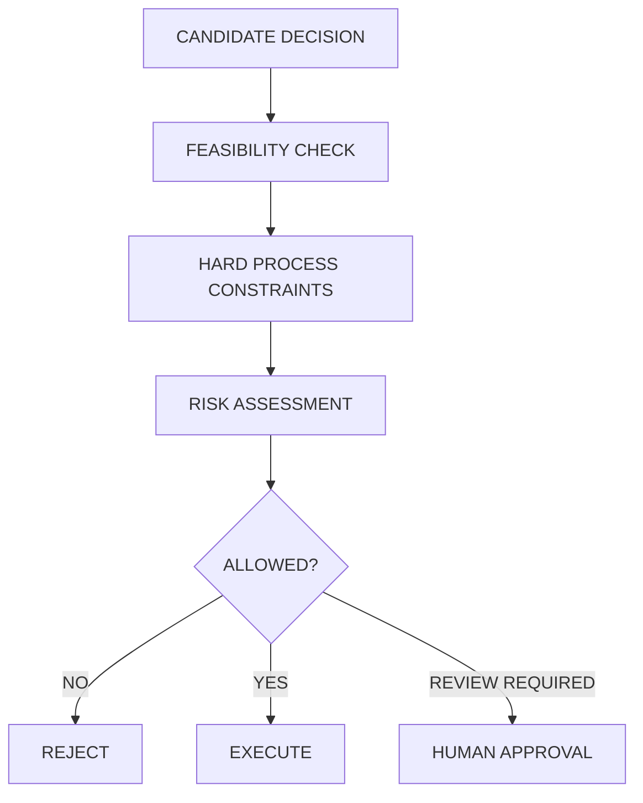

---

# Evaluation

The final system will be evaluated against strong baselines.

Key evaluation dimensions:

- **Decision quality**
- **Robustness under distribution shift**
- **Adaptation speed**
- **Sample efficiency**
- **Information efficiency**
- **Uncertainty calibration**
- **Constraint adherence**
- **Transfer to unseen conditions**

Each major component will be subjected to controlled ablations.

The goal is not to demonstrate architectural complexity.

> **Every component must produce measurable research value.**

---

# Final TELESTO Workflow

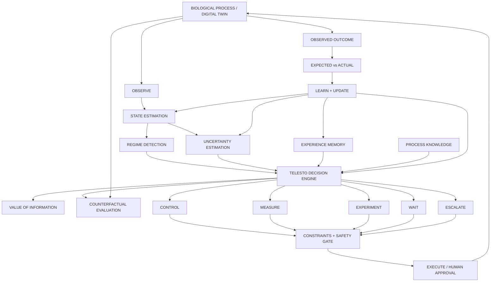

---

# Repository Structure

```text
TELESTO/
├── apps/
├── biocontrolos/
│   └── environment/
│       ├── process_adapter.py
│       └── fermentation_env.py
├── configs/
├── data/
├── docs/
├── experiments/
├── scripts/
├── tests/
├── pyproject.toml
└── README.md
```

`biocontrolos/` is retained as the implementation namespace while the research project evolves under the **TELESTO** identity.

---

# Design Principles

- **Environment before intelligence**
- **Evidence before complexity**
- **Uncertainty must influence decisions**
- **Information can be an action**
- **Memory must change future behaviour**
- **LLMs remain bounded by process knowledge and safety**
- **Every major claim must be experimentally reproducible**

---

## TELESTO

**Scale-Adaptive Intelligence for Biological Manufacturing**

> **Don't just optimize the process. Learn the process.**