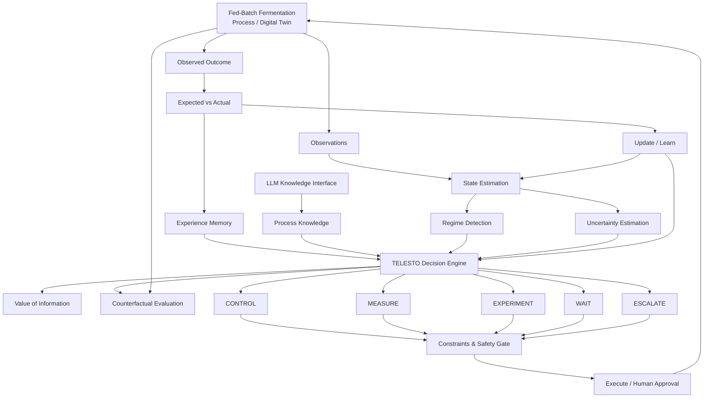

# TELESTO

## Scale-Adaptive Intelligence for Biological Manufacturing

> **Learning how biological processes change as they scale — and deciding what to do next.**

TELESTO is a research project investigating **adaptive decision-making in biological manufacturing under changing process dynamics**.

The system is designed to determine not only **what action to take**, but also **when to measure, experiment, wait, or escalate because the current process is no longer well understood**.

Our first domain is **fed-batch microbial fermentation**.

---

## Research Question

> **Can an uncertainty-aware decision system adapt a learned fermentation policy across scale and operating-regime shifts while learning when additional information is worth acquiring?**

---

# Research Architecture



### Core loop

```text
PROCESS
   ↓
OBSERVE
   ↓
STATE + REGIME + UNCERTAINTY
   ↓
MEMORY + PROCESS KNOWLEDGE
   ↓
TELESTO DECISION
   ↓
CONTROL / MEASURE / EXPERIMENT / WAIT / ESCALATE
   ↓
CONSTRAINTS + SAFETY
   ↓
EXECUTE
   ↓
OBSERVED OUTCOME
   ↓
EXPECTED vs ACTUAL
   ↓
LEARN + REMEMBER
   ↓
NEXT DECISION
```

---

# Current Status

### Phase 0 — Research Definition
**Complete**

### Phase 1 — Fermentation Digital Twin
**Current**

> **Environment before intelligence.**

We are starting by building and validating the fermentation environment. RL, uncertainty, memory, and the LLM layer come later.

---

# Phase 1 — Fermentation Digital Twin

The first implementation uses **IndPenSim / PenSimPy** as the initial fermentation research testbed, wrapped behind a TELESTO-owned process interface.

```text
IndPenSim / PenSimPy
        ↓
Process Adapter
        ↓
TELESTO Fermentation Environment
        ↓
State / Observation / Action / Outcome
```

## Environment

The environment must provide:

**State**

Biomass, substrate, product, dissolved oxygen, temperature, pH, volume, and relevant process variables.

**Observations**

The measurable process variables available to the decision system, including realistic observation limitations such as noise or delay where applicable.

**Actions**

A controlled set of meaningful process inputs, initially focused on variables such as feed, aeration, and agitation.

**Transition**

Advance the fermentation process by a defined timestep.

**Outcome**

Process trajectory, objective metrics, constraints, and batch results.

---

# Phase 1 Deliverables

```text
✓ Simulator running
✓ Process adapter
✓ Fermentation environment
✓ State interface
✓ Observation interface
✓ Action interface
✓ Defined process timestep
✓ Complete batch simulation
✓ Trajectory visualization
✓ Reproducibility checks
✓ Basic validation tests
✓ Initial process constraints
```

The milestone is complete only when the fermentation environment is reliable enough to support controlled experiments.

---

# Research Roadmap

```text
01  FERMENTATION DIGITAL TWIN
          ↓
02  CONTROL BASELINES
          ↓
03  SCALE / REGIME SHIFT
          ↓
04  UNCERTAINTY + REGIME DETECTION
          ↓
05  ADAPTIVE DECISION POLICY
          ↓
06  INFORMATION AS AN ACTION
          ↓
07  COUNTERFACTUAL EVALUATION
          ↓
08  EXPERIENCE MEMORY
          ↓
09  PROCESS KNOWLEDGE + LLM
          ↓
10  FULL TELESTO
          ↓
11  ABLATION + ROBUSTNESS STUDIES
```

---

# Long-Term System

TELESTO will eventually study whether a system can:

- recognize distribution and scale shifts
- identify when its learned policy is unreliable
- decide when information is worth acquiring
- evaluate alternative futures using the digital twin
- reuse relevant previous experience
- incorporate structured process knowledge
- remain within process and safety constraints

The LLM is intended as a **process-knowledge interface**, not an unrestricted controller.

---

# Evaluation

The final system will be evaluated against strong baselines using:

- decision quality
- robustness under distribution shift
- adaptation speed
- sample efficiency
- information efficiency
- uncertainty calibration
- constraint adherence
- transfer to unseen conditions

Ablation studies will determine whether each major component provides measurable value.

---

# Repository Structure

```text
TELESTO/
├── apps/
├── biocontrolos/
│   └── environment/
│       ├── process_adapter.py
│       └── fermentation_env.py
├── configs/
├── data/
├── docs/
├── experiments/
├── scripts/
├── tests/
├── pyproject.toml
└── README.md
```

`biocontrolos/` is retained as the implementation namespace while the research project evolves under the **TELESTO** identity.

---

# Design Principles

**Environment before intelligence.**

**Evidence before complexity.**

**Uncertainty must influence decisions.**

**Information can be an action.**

**Memory must change future behaviour.**

**LLMs are bounded by process knowledge and safety constraints.**

**Every major claim must be experimentally reproducible.**

---

## TELESTO

**Scale-Adaptive Intelligence for Biological Manufacturing**

> **Don't just optimize the process. Learn the process.**